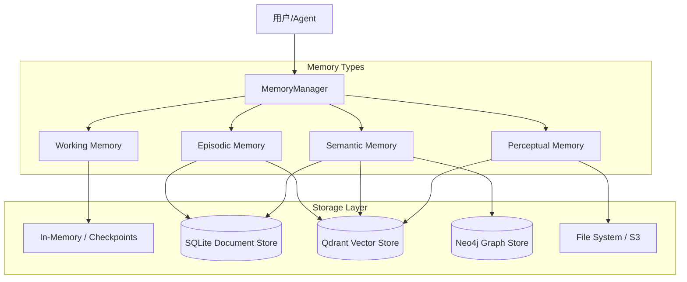

# VerAgents Memory System (VAMS)

## 📖 概述 - Overview

**VerAgents Memory System (VAMS)** 是一个受认知科学启发的多层次、混合存储记忆架构。它旨在为智能体提供类似人类的记忆能力，包括短期感知、长期事件记录、语义知识构建以及自动化管理机制。

### 核心特性

*   **多层次架构**：涵盖工作记忆（Working）、情景记忆（Episodic）、语义记忆（Semantic）和感知记忆（Perceptual）。
*   **混合存储引擎**：
    *   **SQLite**：用于结构化元数据、原始内容的高可靠存储。
    *   **Qdrant**：用于高维向量检索，支持基于语义的相似性搜索。
    *   **Neo4j**：用于构建知识图谱，表达实体间的复杂关系。
*   **统一管理**：通过 `MemoryManager` 提供单一入口，简化了不同记忆类型的交互。
*   **自动分类与重要性评估**：内置基于规则或 LLM 的记忆分类器与重要性评分机制。

---

## 🏗️ 架构设计 - Architecture

系统采用分层设计，每一层负责特定的认知功能：



### 1. Working Memory (工作记忆)

*   **功能**：模拟人类的短期记忆，用于存储当前对话上下文、临时任务状态。
*   **特性**：
    *   **容量限制**：基于 Token 数量或条目数限制（如 `max_tokens=2000`）。
    *   **自动遗忘**：超出容量时，旧记忆会被移除或转移至长期记忆。
    *   **TTL (Time-To-Live)**：支持短暂信息的自动过期。
*   **适用场景**：多轮对话上下文管理、即时推理缓存。

### 2. Episodic Memory (情景记忆)

*   **功能**：记录具体的事件、对话历史和交互过程，带有时间与空间标签。
*   **特性**：
    *   **时间序列**：所有条目均包含精确的时间戳。
    *   **向量检索**：通过 Embedding 技术实现基于语义的事件回溯。
    *   **重要性评分**：根据事件的重要性决定是否长期保留。
*   **适用场景**：用户偏好学习、历史行为分析、长期任务上下文恢复。

### 3. Semantic Memory (语义记忆)

*   **功能**：存储抽象知识、事实、概念及其相互关系，构成智能体的世界观。
*   **特性**：
    *   **知识图谱**：使用 Neo4j 存储实体（Nodes）与关系（Edges）。
    *   **混合检索**：结合向量搜索（模糊匹配）与图谱遍历（精确关系查询）。
    *   **实体提取**：自动从非结构化文本中提取关键实体。
*   **适用场景**：领域知识管理、复杂推理、事实核查。

### 4. Perceptual Memory (感知记忆)

*   **功能**：处理和存储原始的多模态感官数据（图像、音频片段、原始日志）。
*   **特性**：
    *   **多模态支持**：关联文本描述与原始媒体文件。
    *   **跨模态检索**：通过文本描述检索图像或音频。
*   **适用场景**：多模态交互记录、原始数据存档。

---

## 💻 核心组件 - Components

### MemoryManager

`MemoryManager` 是系统的核心控制器，负责协调各类记忆的读写操作。

```python
from veragents.memory.manager import MemoryManager
from veragents.memory.base import MemoryConfig

config = MemoryConfig(storage_path="./data")
manager = MemoryManager(config=config, user_id="user_123")

# 添加记忆（自动分类或指定类型）
manager.add_memory("用户喜欢红色", memory_type="semantic")
manager.add_memory("今天下午2点开会", memory_type="episodic")

# 检索记忆
results = manager.retrieve_memories("用户喜好", limit=5)
```

### Storage Engines

*   **SQLiteDocumentStore**:基于 SQLite 的轻量级文档存储，无需额外服务依赖，支持复杂的元数据查询。
*   **QdrantStore**: 高性能向量数据库封装，支持 Payload 过滤（如按 `user_id` 或 `timestamp` 筛选）。
*   **Neo4jStore**: 图数据库封装，提供 Cypher 查询接口，用于语义关联分析。

---

## ⚙️ 配置与使用 - Configuration

通过环境变量或 `MemoryConfig` 类进行配置。关键环境变量如下：

```env
# 基础配置
MEMORY_STORAGE_PATH=./memory_data    # SQLite 数据存储路径

# Qdrant (向量存储)
QDRANT_URL=https://your-cluster.qdrant.io
QDRANT_API_KEY=your_api_key
QDRANT_COLLECTION=veragents_vectors

# Neo4j (知识图谱 - 可选)
NEO4J_URI=neo4j+s://your-instance.neo4j.io
NEO4J_USER=neo4j
NEO4J_PASSWORD=your_password

# Embedding 模型
EMBED_base_url=https://api.openai.com/v1
EMBED_API_KEY=your_key
EMBED_MODEL_NAME=text-embedding-3-small
```

详细使用示例请参考 `examples/memory/` 目录下的演示脚本。
