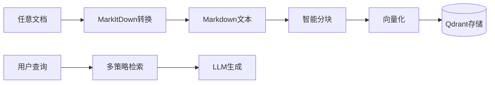

# VerAgents RAG System (VRAG)

---

## 📖 概述 - Overview

**VerAgents RAG System (VRAG)** 是 VerAgents 智能体框架中的核心工具型子系统。与通用的记忆系统（Memory System）不同，VRAG 专为处理大规模非结构化文档、知识库问答（KBQA）和增强检索生成（Retrieval-Augmented Generation）任务而设计。

它采用了**“五层七步”**的先进架构设计，旨在提供**模块化、可扩展、高性能**的 RAG 解决方案。

*   **五层**：用户层、应用层、处理层、存储层、基础层。
*   **七步**：用户请求 -> 接口路由 -> 应用逻辑 -> 文档解析 -> 智能分块 -> 向量化 -> 存储/检索。

---

## 🏗️ 核心架构 - Architecture

### 1. 五层架构设计

这种分层设计的核心优势在于**每一层都可以独立优化和替换**，确保系统的灵活性与稳定性。

| 层级 | 职责描述 | 关键组件/技术 |
| :--- | :--- | :--- |
| **用户层 (User Layer)** | 统一交互接口，屏蔽底层复杂性。 | **`RAGTool`** (标准 Agent 工具接口), CLI |
| **应用层 (App Layer)** | 具体业务逻辑实现。 | 智能问答 (QA), 语义搜索, 知识库管理 |
| **处理层 (Process Layer)** | 文档到数据的核心转换流程。 | **`MarkItDown`** (全格式解析), **Markdown 智能分块**, Token 计算 |
| **存储层 (Storage Layer)** | 持久化与索引。 | **`Qdrant`** (向量数据库), **`SQLite`** (文档正文/元数据) |
| **基础层 (Infra Layer)** | 底层模型与计算资源。 | Embedding Models (OpenAI/Ollama/HuggingFace), LLM, Neo4j (可选图谱) |

### 2. 核心处理流程 (The Pipeline)

整个流程遵循标准化的数据流向：

1.  **Ingest (摄入)**：接收任意格式文档。
2.  **Convert (转换)**：通过 `MarkItDown` 统一转换为 **Markdown** 格式。
3.  **Chunk (分块)**：基于 Markdown 结构的智能分块策略。
4.  **Embed (向量化)**：批量生成 Embedding 向量。
5.  **Index (索引)**：存入 Qdrant 并构建 Payload 索引。
6.  **Retrieve (检索)**：多策略混合检索 (MQE + HyDE)。
7.  **Generate (生成)**：LLM 基于上下文生成最终回答。



---

## 🚀 关键特性 - Key Features

### 1. 全格式文档处理 (powered by MarkItDown)

VRAG 集成了微软开源的 `MarkItDown` 工具，能够将几乎所有常见文档格式统一转换为高质量的 Markdown 文本。这意味着后续的处理流程（分块、向量化）只需针对 Markdown 这一种格式进行优化。

*   **支持格式**：PDF, Word (.docx), Excel (.xlsx), PowerPoint (.pptx), Images (OCR), Audio (Transcription), HTML, JSON, XML, Code, etc.
*   **优势**：保留文档的结构信息（标题、列表、表格），为后续的智能分块提供语义基础。

### 2. Markdown 感知智能分块 (Structure-Aware Chunking)

传统的按字符数分块（Fixed-size Chunking）往往会破坏语义完整性。VRAG 实现了**基于 Markdown 结构的智能分块算法**：

*   **标题层级解析**：自动识别 `#`, `##` 等标题，将文档分割为具有语义层级的段落。
*   **语义边界保持**：确保同一段落内容尽量不被切断。
*   **Token 级控制**：结合近似 Token 计数（支持中英文混合），精确控制分块大小（如 512 tokens）。
*   **重叠优化**：在分块边界添加重叠内容，保持上下文连贯。
*   **元数据增强**：每个分块自动携带其所属的 `heading_path`（如 "深度学习 > CNN > 卷积层"），极大提升了检索结果的可解释性。

### 3. 多策略高级检索 (Advanced Retrieval)

VRAG 不仅仅是简单的向量相似度匹配，还内置了两种高级检索策略，显著提升复杂查询的召回率和准确率：

*   **MQE (Multi-Query Expansion, 多查询扩展)**：
    *   **原理**：利用 LLM 将用户的一个问题改写为多个语义等价的查询（如 "如何学Python" -> "Python入门教程", "Python学习路径"）。
    *   **优势**：覆盖更多潜在的文档关键词，特别是解决用户提问表述不准确的问题。
    *   **实现**：并行检索扩展后的所有查询，通过去重与重排序（Rerank）合并结果。

*   **HyDE (Hypothetical Document Embeddings, 假设文档嵌入)**：
    *   **原理**：利用 LLM 针对用户问题生成一个“假设性答案”（Hypothetical Answer），然后用这个假设答案去检索真实文档。
    *   **优势**：将“问题-文档”匹配转化为“答案-文档”匹配，显著提升语义相似度，特别适合事实类问答。

### 4. 统一接口 (Standardized Tool Interface)

VRAG 遵循 VerAgents 的工具标准，以 `rag_tool` 的形式提供服务，这使得 Agent 可以直接调用 RAG 能力，无需关心底层实现。

*   `rag_ingest_file(path)`: 智能载入文件。
*   `rag_query(question)`: 端到端问答。
*   `rag_search(query)`: 纯检索，返回相关片段。

---

## 🛠️ 配置说明 - Configuration

VRAG 依赖环境变量进行配置，与 Memory System 共享部分基础设置。

```env
# RAG 专用向量存储配置
QDRANT_URL=https://your-cluster.qdrant.io
QDRANT_API_KEY=your_key
QDRANT_COLLECTION=rag_knowledge_base  # RAG 专用集合

# LLM 与 Embedding (用于分块、扩展查询、生成回答)
PROVIDER=openai  # 或 zhipu, intern, aiping 等
OPENAI_BASE_URL=https://api.openai.com/v1
OPENAI_API_KEY=sk-...
EMBED_MODEL_NAME=text-embedding-3-small
```

---

## 💻 使用示例 - Usage

### Python API

```python
from veragents.memory.rag import create_rag_pipeline

# 1. 初始化
pipeline = create_rag_pipeline(
    knowledge_base_path="./my_kb",
    collection_name="my_rag_collection"
)

# 2. 载入文档 (支持任意格式)
pipeline.ingest_file("data/manual.pdf")
pipeline.ingest_file("data/report.docx")

# 3. 简单检索
results = pipeline.search("核心架构是什么？", top_k=3)

# 4. 高级问答 (启用 MQE 和 HyDE)
answer = pipeline.query(
    "总结一下五层架构的优势",
    enable_mqe=True,
    enable_hyde=True
)
print(answer['answer'])
```

### Agent Tool 调用

作为 Agent，可以直接使用注册的工具：

```python
# 假设 tool_manager 已加载 rag_tool
result = tool_manager.call(
    "rag_query", 
    question="项目的时间线是怎样的？",
    enable_mqe=True
)
```

详细代码演示请参考 `examples/memory/rag_demo.py`。
